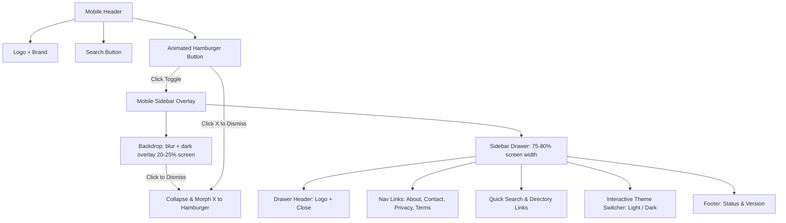

# Mobile Navigation Sidebar & Animated Hamburger Menu Plan

## 1. Overview & Objectives

In mobile viewports (`< lg`), the top navigation links (**About**, **Contact**, **Privacy**, **Terms**) are currently hidden, leaving the footer as the only place to access them. 

This plan introduces a responsive, collapsible **Mobile Navigation Drawer** that:
1. Replaces the standalone mobile theme toggle in the header navbar with an **Animated Hamburger Menu Button**.
2. Slides out a sidebar drawer covering **75%–80% of the screen width** from the right, with a **blurred backdrop overlay** (`backdrop-blur-xs bg-black/60`) matching the Money Split modal design.
3. Features an animated transition from **Hamburger (3 lines)** to **Close (X)** icon when opened, and seamlessly back to Hamburger when closed.
4. Provides two intuitive ways to collapse the drawer:
   - **Method 1**: Clicking the Cross (X) / Hamburger button.
   - **Method 2**: Clicking anywhere on the blurred background outside the drawer.
   - *(Also supports pressing the `Escape` key and clicking any navigation link).*
5. Houses the **About**, **Contact**, **Privacy**, **Terms** links, a dedicated **Dark/Light Mode Theme Switcher**, quick search trigger, and brand status footer.

---

## 2. Component Architecture & Visual Layout

---

## 3. Detailed Implementation Specifications

### A. Animated Hamburger Button in Navbar
- **Placement**: Inside `<header>` right action cluster (`flex lg:hidden`).
- **Desktop Toggle**: Hidden on mobile (`hidden lg:flex`), keeping navbar uncluttered on small screens.
- **Morphing Icon Mechanism**:
  - Three lightweight, GPU-accelerated CSS bars (`w-5 h-0.5 bg-current rounded-full transition-all duration-300 origin-center`).
  - **Closed State (Hamburger)**: 3 parallel horizontal bars.
  - **Open State (Cross X)**: Top bar rotates `45deg` down, middle bar scales to `0` opacity, bottom bar rotates `-45deg` up.
  - Full keyboard accessibility with `aria-expanded="false"`, `aria-controls="mobile-sidebar"`, and `aria-label="Toggle navigation menu"`.

### B. Blurred Backdrop Overlay
- **Class**: `fixed inset-0 z-50 bg-black/60 backdrop-blur-xs transition-opacity duration-300`
- **Behavior**:
  - Closed: `opacity-0 pointer-events-none`
  - Open: `opacity-100 pointer-events-auto`
  - Clicking on this overlay immediately closes the drawer and reverses the hamburger animation.

### C. Sidebar Drawer Panel
- **Dimensions**: `w-[78vw] sm:w-80 max-w-xs fixed top-0 right-0 bottom-0 z-50`
- **Styling**: `bg-white dark:bg-neutral-950 border-l border-neutral-200 dark:border-neutral-800 shadow-2xl transition-transform duration-300 ease-out`
- **Translate**: `translate-x-full` when closed $\rightarrow$ `translate-x-0` when open.
- **Sections**:
  1. **Top Drawer Header**:
     - Brand Icon + "All Calc Kit" title + version pill `v1.0`.
  2. **Navigation Group**:
     - **About** (`/about`) with icon
     - **Contact** (`/contact`) with icon
     - **Privacy Policy** (`/privacy`) with icon
     - **Terms of Service** (`/terms`) with icon
     - Quick CTA: **Search Tools (⌘K)** & **Tools Directory**
  3. **Theme Switcher Section**:
     - Segmented or card-style toggle with Sun (Light) and Moon (Dark) indicators.
     - Live synchronization with `localStorage.getItem('ack_theme')` and `document.documentElement.classList`.
  4. **Bottom Status Indicator**:
     - Green pulsing dot: `Status: All Systems Operational`.

### D. Client Controller Script
- Unified state controller function: `toggleMobileMenu(forceState?)`.
- Handles:
  - Slide in/out CSS classes (`translate-x-full` vs `translate-x-0`).
  - Backdrop opacity and pointer events (`opacity-0 pointer-events-none` vs `opacity-100 pointer-events-auto`).
  - Icon state (`is-open` class toggling rotation transforms).
  - Body scroll lock (`document.body.classList.toggle('overflow-hidden')`).
  - `Escape` key dismiss listener.
  - Auto-close when clicking internal navigation links.

---

## 4. Verification & Testing Plan

1. **Responsive Visual Testing**:
   - Verify desktop view (`>= 1024px`): Navbar links (About, Contact, Privacy, Terms), search bar, and desktop theme toggle remain visible; hamburger button is hidden.
   - Verify mobile view (`< 1024px`): Hamburger button is visible; desktop theme toggle is hidden; header layout is balanced and uncluttered.
2. **Animation & Interaction Testing**:
   - Verify smooth 300ms transition from Hamburger lines into Cross (X).
   - Test Dismiss Method 1: Clicking the X button collapses drawer and morphs icon back to Hamburger.
   - Test Dismiss Method 2: Clicking the blurred remaining 22% screen collapses drawer and morphs icon back to Hamburger.
   - Test Dismiss Method 3: Pressing `Escape` key closes drawer.
   - Test Dismiss Method 4: Clicking any page link inside drawer closes drawer.
3. **Theme Toggle Testing**:
   - Test switching theme inside the mobile sidebar (switches between Light and Dark mode instantly without page reload, updates stored preference, and reflects in desktop toggle as well).
4. **Automated Suite & Build**:
   - Run `npm test` (all 243 vitest tests).
   - Run `npm run build` (full Astro static compilation).
