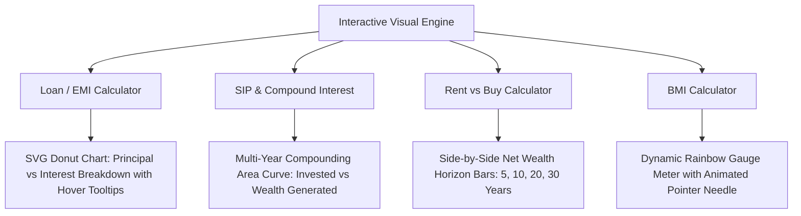
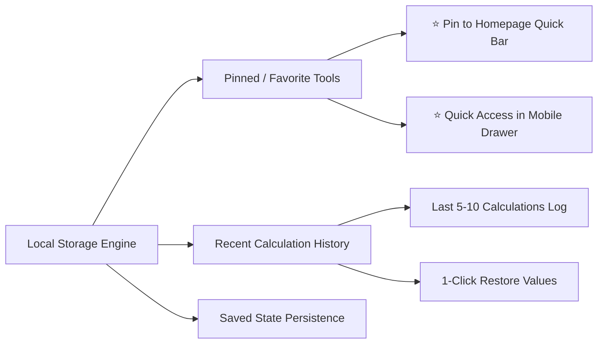
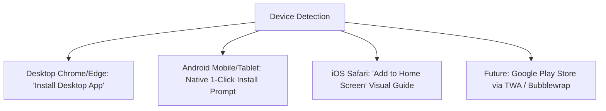
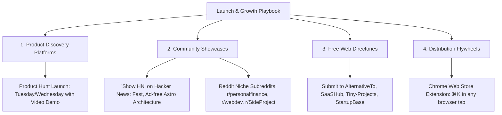

# AllCalcKit v1.2 — Product Roadmap & Growth Strategy Plan

## 1. Executive Summary & Vision

**AllCalcKit** (`allcalckit.com`) is a lightweight, ad-free, ultra-fast web calculator suite built with Astro SSG and Tailwind CSS v4. Version `v1.2` elevates the application from a collection of simple calculation utilities into an interactive, visual, and highly sticky personal tool hub.

### Core Goals for v1.2:
1. **Visual Data & Reactive Charts**: Transform static number outputs into dynamic SVG/Canvas visual charts that update in real time with `<5ms` latency.
2. **Personalization & Retention**: Introduce persistent **Pinned / Favorite Tools** (⭐) and a **Recent Tools / Calculation History** drawer without requiring user login.
3. **Adaptive Web App Installation**: Provide dynamic, device-aware "Install App" triggers for Desktop, Android, Tablet, and iOS PWA, with a roadmap to Google Play Store via Trusted Web Activity (TWA).
4. **Lightweight Client-Side Exports**: Enable instant 1-click CSV downloads for tables/schedules and print-optimized PDF outputs with zero backend overhead.
5. **High-Value New Calculators**: Introduce flagship modern calculators targeting high search volume and high community interest (Freelance Rate, Startup Runway, Crypto DCA, Inflation).
6. **Launch & Growth Distribution**: Execute a structured distribution strategy across Product Hunt, Hacker News, niche communities, and web directories.

---

## 2. Interactive Charts & Visual Data Engine



### 2.1 Loan EMI Donut Chart
* **Visual**: SVG Donut chart displaying the proportion of **Principal Amount** vs **Total Interest Payable**.
* **Interactivity**: Dynamic arc path calculation that smoothly updates on slider/input changes; displays percentage breakdown and currency amounts on hover.

### 2.2 SIP & Compound Interest Compounding Curves
* **Visual**: Interactive Area / Line chart showing the year-by-year trajectory of **Total Investment** vs **Total Future Wealth** over 1 to 30 years.
* **Interactivity**: Hovering over any year shows a tooltip with exact principal invested, accumulated interest, and total balance.

### 2.3 Rent vs Buy Horizon Comparison Bars
* **Visual**: Dual-bar comparison comparing **Net Wealth from Buying** (home equity minus costs) against **Net Wealth from Renting & Investing** across 5, 10, 20, and 30-year milestones.

### 2.4 BMI Visual Gauge Meter
* **Visual**: Semi-circular colored gauge with defined brackets (Underweight: Blue, Normal: Emerald, Overweight: Amber, Obese: Rose).
* **Interactivity**: Animated needle smoothly pivots to the user's calculated BMI score.

---

## 3. Retention & Personalization (Zero-Login Architecture)



### 3.1 Pinned / Favorite Tools (⭐)
* **User Flow**: Users click a small star icon (⭐) on any calculator card or tool page.
* **UI Integration**:
  * Pinned tools appear in a prominent **"Your Pinned Tools"** quick-access tray at the top of the Homepage.
  * Pinned tools are highlighted with a star in the **Search Palette (`⌘K`)** and in the **Mobile Sidebar Drawer**.
* **Storage**: Stored in `localStorage` under `ack_pinned_tools` array of IDs.

### 3.2 Recent Tools & Calculation History
* Automatically records the last 5-8 used calculators with their calculated outputs and timestamps.
* Accessible via a "Recent Activity" tab in the search modal or homepage, allowing users to restore previous numbers with one click.

---

## 4. Exports & Printable Summaries (Client-Side Architecture)

### 4.1 Technical Approach & Performance Analysis
* **Why Client-Side Exports Are 100% Free & Fast**:
  * Since AllCalcKit runs client-side on Cloudflare Pages / CDN, generating a CSV or formatted PDF occurs entirely on the user's local device.
  * 0 server resources are consumed, meaning 100,000 simultaneous downloads will not slow down the site.
* **1-Click CSV Download** *(Zero Bundle Overhead)*:
  * Generates raw CSV blobs for tables (e.g. Loan Amortization Schedules, Expense Split breakdowns) using standard 5-line native JavaScript (`Blob` + `URL.createObjectURL`).
* **Print-to-PDF Formatting**:
  * Dedicated `@media print` CSS clean-sheet that strips headers, sidebars, and ads, formatting the amortization schedule or calculation summary into an elegant 1-page PDF invoice/report via `window.print()`.
* **Future Roadmap**: Full PDF document rendering and cloud cloud-synced reports will be expanded once backend user accounts are introduced.

---

## 5. Device-Adaptive Web App Installation (PWA & Play Store Roadmap)



### 5.1 Dynamic Install Triggers
* **Desktop (Chrome / Edge / Brave / Opera)**:
  * Captures `beforeinstallprompt` event.
  * Renders a button in header / footer / sidebar: **"Install Desktop App"**. Clicking triggers the native OS install window.
* **Android (Mobile & Tablet)**:
  * Prompts with a native install banner: **"Install App for Offline Use"**.
* **iOS Safari (iPhone / iPad)**:
  * Detects iOS User-Agent and standalone status (`window.navigator.standalone`).
  * Shows a sleek tooltip: *"Tap the Share button ⎋ and select 'Add to Home Screen' ⊞ for instant offline access"*.

### 5.2 Google Play Store Roadmap (Trusted Web Activity - TWA)
* Because AllCalcKit is a compliant PWA with HTTPS, service worker offline caching, and web app manifest, it can be wrapped into an Android `.apk` / `.aab` using Google's **Bubblewrap CLI** without rewriting any frontend code.

---

## 6. Flagship High-Value Calculator Candidates

| Tool Name | Target Audience | Key Features & Value Proposition |
| :--- | :--- | :--- |
| **1. Freelance Rate $\leftrightarrow$ Salary Calculator** | Freelancers, Contractors, Consultants | Calculates true billing rate accounting for self-employment taxes, unbillable admin hours, healthcare, equipment, software, and vacation buffer. |
| **2. Startup Runway & Burn Rate Estimator** | Founders, Indie Hackers, Startups | Interactive scenario planner: Current cash, monthly expenses, revenue growth, and hiring projections with runway depletion curve. |
| **3. Crypto DCA & Profit/Loss Simulator** | Crypto Investors, Finance Enthusiasts | Clean, non-cluttered Dollar Cost Averaging simulator showing accumulation and break-even targets. |
| **4. Historical Inflation & Purchasing Power** | General Consumers, Homeowners | Calculates purchasing power parity across historical CPI data (e.g. "$100 in 1990 = $X today"). |

---

## 7. Launch & Growth Distribution Playbook

### What is Launch & Growth Distribution?
Building a website is 50% of the journey; distribution is the remaining 50% to bring consistent real-world users. Launch & Growth Distribution is the structured execution to generate initial traffic, backlinks, and brand awareness:



1. **Product Hunt Launch**:
   * Official launch day on ProductHunt.com.
   * High-quality animated GIF demos of `<5ms` calculation, `⌘K` command palette, and dark mode.
2. **Hacker News ("Show HN")**:
   * Submit to `news.ycombinator.com`: *"Show HN: AllCalcKit – Fast, ad-free, dark-mode calculator suite built with Astro"*.
   * Technical focus: 100% client-side privacy, offline PWA, zero trackers.
3. **Targeted Subreddit Showcases**:
   * `r/InternetIsBeautiful` & `r/webdev`: Speed, aesthetics, and user experience.
   * `r/personalfinance`: *Rent vs Buy* and *Loan EMI* visualizers.
4. **Web Tool Directories & Backlinks**:
   * Submissions to AlternativeTo, ProductHunt, Slant, SaaSHub, and indie web rings to establish baseline domain authority for Google search indexing.
5. **Chrome / Edge Browser Extension**:
   * A lightweight extension embedding the AllCalcKit `⌘K` converter palette into any new browser tab.

---

## 8. Phased v1.2 Implementation Roadmap

```
├── Phase 1.1: Interactive Visual Data Engine (Loan EMI Donut, SIP Curve, BMI Gauge)
├── Phase 1.2: Favorites (⭐ Pinned Tools) & Recent Calculation History
├── Phase 1.3: Device-Adaptive PWA Install Triggers (Mobile, Tablet, Desktop)
├── Phase 1.4: 1-Click CSV & Print-to-PDF Formatter
├── Phase 2.1: Flagship Calculator: Freelance Rate & Take-Home Calculator
├── Phase 2.2: Flagship Calculator: Startup Runway & Monthly Burn Estimator
├── Phase 2.3: Flagship Calculator: Crypto DCA & Inflation Calculators
└── Phase 3.0: Product Hunt & Hacker News Launch Execution
```
